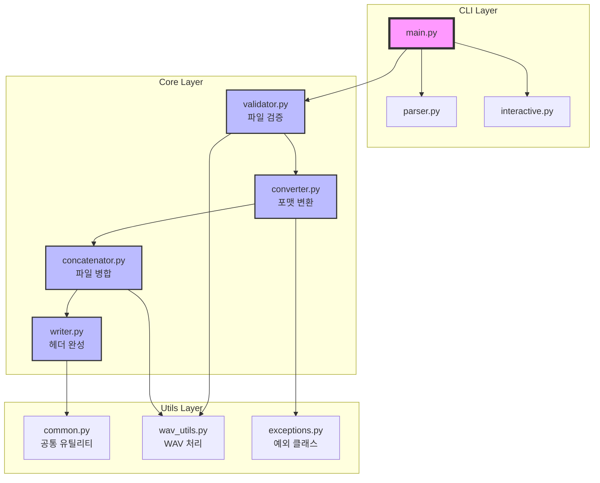

# Audio Merge - WAV 파일 병합 도구

여러 개의 WAV 파일을 하나로 병합하는 Python 명령줄 도구입니다. 스트리밍 방식으로 대용량 파일도 효율적으로 처리할 수 있으며, 자동 포맷 변환과 크로스페이드 기능을 제공합니다.

## 주요 기능

- ✅ **무손실 병합**: PCM 포맷 WAV 파일을 품질 손실 없이 병합
- ✅ **자동 포맷 변환**: 서로 다른 포맷의 파일을 자동으로 변환하여 병합
- ✅ **스트리밍 처리**: 메모리 효율적인 스트리밍 방식으로 대용량 파일 처리
- ✅ **크로스페이드**: 파일 간 부드러운 전환을 위한 페이드 효과
- ✅ **진행률 표시**: 대용량 파일 처리 시 진행률 로깅
- ✅ **유연한 사용**: CLI 모드와 Interactive 모드 지원

## 설치

### 사전 요구사항

- Python 3.8 이상
- FFmpeg (시스템에 설치되어 있어야 함)

### 설치 방법

```bash
# 저장소 클론
git clone https://github.com/yourusername/python-audio-merge.git
cd python-audio-merge

# 가상환경 생성 및 활성화
python3 -m venv venv
source venv/bin/activate  # Windows: venv\Scripts\activate

# 의존성 설치
pip install -r requirements.txt
```

## 사용 방법

### Command-line 모드

```bash
# 기본 사용법
python main.py file1.wav file2.wav file3.wav

# 옵션 지정
python main.py --output merged.wav --auto-convert --fade 500 file1.wav file2.wav

# 전체 옵션 보기
python main.py --help
```

### Interactive 모드

```bash
# 파일을 지정하지 않으면 대화형 모드로 실행
python main.py
```

### 옵션 설명

- `-o, --output`: 출력 파일 경로 (기본: merged.wav)
- `--auto-convert`: 포맷이 다른 파일 자동 변환
- `--fade`: 파일 간 크로스페이드 길이 (밀리초)
- `--buffer-size`: 스트리밍 버퍼 크기 (바이트, 기본: 65536)
- `--verbose`: 상세 로그 출력
- `--log-file`: 로그 파일 경로

## 아키텍처



### 처리 흐름

1. **파일 검증** (validator.py)
   - WAV 파일 유효성 검사
   - 포맷 정보 추출
   - 포맷 일관성 확인

2. **포맷 변환** (converter.py)
   - 필요 시 자동 변환
   - 최고 품질 포맷으로 통일
   - 임시 파일 생성 및 관리

3. **파일 병합** (concatenator.py)
   - 스트리밍 방식 데이터 복사
   - 크로스페이드 효과 적용
   - 4GB 크기 제한 확인

4. **헤더 완성** (writer.py)
   - RIFF/data 청크 크기 업데이트
   - 파일 구조 검증

## 예제

### 간단한 병합
```bash
python main.py voice1.wav voice2.wav voice3.wav
```

### 다른 포맷 파일 병합
```bash
# 44.1kHz와 48kHz 파일을 자동 변환하여 병합
python main.py --auto-convert track1_44100.wav track2_48000.wav
```

### 크로스페이드 적용
```bash
# 파일 간 500ms 크로스페이드
python main.py --fade 500 intro.wav main.wav outro.wav
```

### 대용량 파일 처리
```bash
# 버퍼 크기를 늘려 성능 향상
python main.py --buffer-size 262144 --verbose large1.wav large2.wav
```

## 개발

### 테스트 실행

```bash
# 전체 테스트
pytest

# 커버리지 포함
pytest --cov=audio_merge

# 특정 테스트만
pytest tests/test_converter.py -v
```

### 코드 품질 도구

```bash
# 코드 포맷팅
black audio_merge tests

# 린팅
flake8 audio_merge tests

# 타입 체킹
mypy audio_merge
```

## 제한사항

- WAV 파일만 지원 (MP3, FLAC 등은 지원하지 않음)
- 4GB 크기 제한 (RIFF 포맷 한계)
- PCM 포맷만 지원 (압축 코덱 미지원)

## 라이선스

MIT License

## 기여하기

1. Fork the repository
2. Create your feature branch (`git checkout -b feature/amazing-feature`)
3. Commit your changes (`git commit -m 'Add amazing feature'`)
4. Push to the branch (`git push origin feature/amazing-feature`)
5. Open a Pull Request 